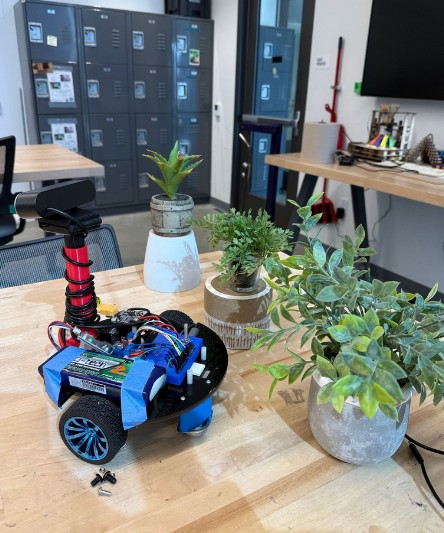
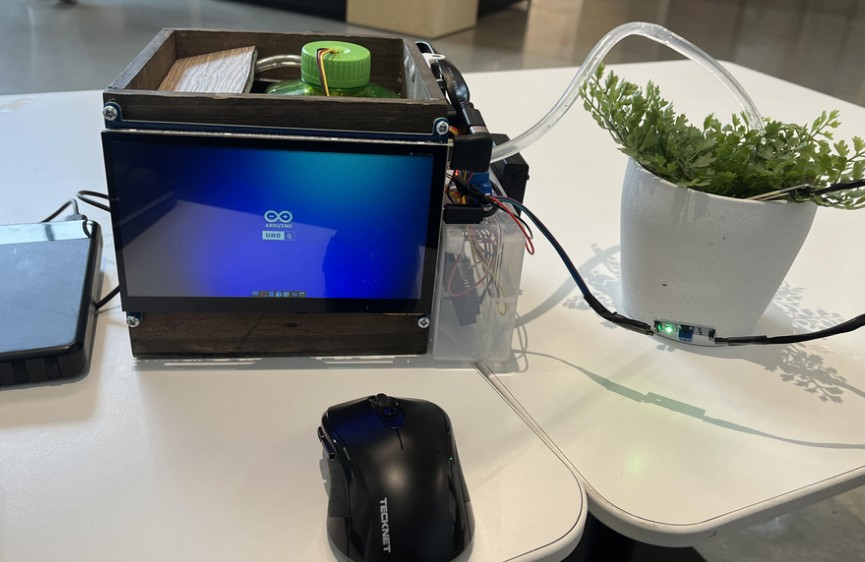

# Edge-AI Mobile Plant Assistant and Watering Station w/ Display

### ECE 180 Final Project
**Team 01 Summer Session I 2026**

---

## Team Members

* **Eric Yi** - Major: Electrical Engineering
* **Kathya Romano** - Major: Electrical Engineering
* **Javier Avila** - Major: Electrical Engineering

---

  
  

  <em>Left: The mobile robot equipped with a camera. Right: The stationary water dispenser and moisture sensor.</em>

## Abstract

The Mobile Plant Assistant (MPA) is a distributed robotic system consisting of a mobile robot and a stationary water pump. A user positions the robot using a joystick to take a precise photo of a target plant. An AI model running on the robot's Arduino UNO Q analyzes the captured image and sends the analysis results to the stationary water pump. The stationary pump features an interactive webpage with options for Healthy, Wilted, and Dead; using the camera's feedback, the user selects the appropriate option. The machine then dispenses water only if needed, based on the plant's condition and live readings from a soil moisture sensor. The project utilizes two Arduino UNO Q boards communicating over a localized, private wireless network. The robot's board navigates to plants and uses a custom-trained ResNet18 computer vision model (deployed via ONNX and OpenCV) to classify plant health (Healthy, Wilted, Dead, or Background). These classifications are processed entirely on the edge device and transmitted via HTTP requests to a Flask server running on the  stationary water pump's board, which determines if the plant requires watering.

---

## Hardware Overview & Configuration

### Hardware List

* **Arduino® UNO™ Q 4GB**
* **Capacitive Soil Moisture Sensor:** Corrosion Resistant for Arduino Moisture Detection Garden Watering DIY (Pack of 2PCS) EK1940 (or any preferred moisture sensor)
* **AEDIKO Upgrade Automatic Irrigation DIY Kit:** Includes Self Watering System with Capacitive Soil Moisture Sensor, 5V Relay Module, Water Pump, and 50cm Silicone Tubing
* **8K 90 Degree HDMI 2.1 Adapter (Optional):** 2 Pack Right Angle HDMI Male to Female L-Shaped Connector Extender
* **Arduino USB-C Hub (8 in 1) [TPX00241]:** Expansion for Development Boards with HDMI, Ethernet, USB-A & USB-C Ports, SD/TF Card Readers (any compatible USB-C Hub works)
* **HDMI Display:** Any display option compatible with HDMI
* **Chassis:** 2WD circular acrylic base with a rear omnidirectional caster wheel for tight maneuvering.
* **Microcontroller:** Arduino UNO Q board handling AI inference, camera input, and hardware signaling.
* **Motor Control:** Dual-channel motor driver module (featuring blue screw terminals) to regulate high-current voltage to the DC motors.
* **Power Supply:** Turnigy Nano-tech High-Discharge LiPo Battery, secured centrally to optimize weight distribution and traction.
* **Vision System:** HD 1080p USB Webcam elevated on a custom 3D-printed red mounting pillar to ensure a level viewing angle of the target plants.

### Connections & Pin Mapping (Stationary Pump)
To map the standalone interactive configuration, the Arduino Uno Q uses separate wiring lanes for sensory inputs (Analog) and relay controls (Digital). All system inputs and modules must share a Unified Ground Rail to prevent voltage drift or false sensor readings.

| Component | Physical Pin on Device | Target Connection Pin on Arduino Uno Q | Wire Role / Function |
| :--- | :--- | :--- | :--- |
| **Soil Moisture Sensor** | GND/- | GND | Sensor Ground Loop |
| | VCC/+ | 3.3V | 5V Operating Power |
| | AUOUT/A0 | A1 | Raw Soil Telemetry Input |
| **Reservoir Level Sensor** | GND/- | GND | Sensor Ground Loop |
| | VCC/+ | 3.3V | 5V Operating Power |
| | OUT/S | A0 | Raw Tank Volume Telemetry Input |
| **Relay Signal Line** | GND/- | GND | Relay Control Ground Loop |
| | VCC/+ | 5V | 5V Optocoupler Power |
| | IN | Digital Pin 3 | Active-Low Command Signal Line |

### Connections & Core Wiring (Mobile Plant Assistant)
* **Power Routing:** The main LiPo battery routes directly into the motor driver's power terminals to safely supply high current to the drive motors.
* **Motor Outputs:** The left and right motor driver terminal channels connect directly to the respective DC wheel motors.
* **Control Pins:** The motor driver's logic pins connect to the Arduino's PWM-capable digital pins to dictate speed and directional rotation.
* **Camera Interface:** The elevated webcam connects directly to the Arduino Q's data ports.

### High-Power Pump Circuit (Relay Output Side)
The water pump cannot draw its operating current directly from the Arduino board pins without overloading the microcontroller chip. Its power loop must be routed independently through the relay's screw terminals. Looking directly at the three blue screw terminal blocks on the output side of the relay module:
* **Center Screw Terminal [COM]:** Connect the Positive (+ / Red) wire coming from the external battery holder (requires 4 AAA batteries provided by the kit).
* **Left Screw Terminal [NO]:** Connect the Positive (Red) power lead wire running directly to the Submersible Water Pump motor input.
* **The Common Ground Bridge:** Twist the Negative (- / Black) wire from the external power pack and the Negative (Black) wire from the water pump directly together using an electrical wire nut or electrical tape. This bypasses the relay completely to form a return loop.

### Connection Verification Check (for stationary pump)
Before flipping on the external pump battery switch, verify the following:
* **The 3.3V Power Split:** Ensure both the analog sensors and the input power side of the relay board are tied firmly to the Arduino's 3.3V rail pin (using a small breadboard layout if necessary).
* **The Pin 3 Shift:** Double-check that the relay's input wire is moved over to Digital Pin 3, leaving Pin 2 completely open.
* **The Left Slot Check:** Confirm that no copper strands are touching the right-hand NC slot of the relay terminal block, keeping the red pump wire clamped into the left-hand NO terminal slot.

### Operational Protocol (for Mobile Plant Assistant)
1. **Power Sequence:** Secure the LiPo battery and connect the main power leads to boot the motor driver and Arduino board.
2. **Remote Link:** Ensure the separate joystick controller (running `Arduino_Robocar_Transmitter.ino`) is powered and actively transmitting control signals to the robot.
3. **Positioning:** Drive the 2WD chassis using the joystick until the elevated webcam is squarely facing the target plant.
4. **Execution:** Initiate `main.py` on the robot to trigger the camera, run the `plant_classifier.onnx` AI model on the captured image, and broadcast the plant's status to the stationary pump.

---

## Stationary Pump Operation Manual
Once the application is launched, the hardware enters an automated monitoring state.

### 1. Understanding the Live Status Display
The station console updates data fields twice a second:
* **Soil Moisture Card:** Displays the live wetness level of the plant's soil from 0% (Bone Dry) to 100% (Saturated).
* **Reservoir Level Card:** Monitors the remaining water volume inside the primary holding tank from 0% (Empty) to 100% (Completely Full).
* **Operational Status Banner:** Displays active system alerts, countdown timers, and contextual plant state reports.

### 2. Standard Care Procedures
The machine evaluates internal metrics against safety thresholds before deploying resources:
* **Option A: Pressing [HEALTHY]**
  * **Condition Check:** If the soil moisture is below 50%, an automatic safety countdown flashes ("Watering in 5s...."). Once it reaches zero, the machine dispenses water for exactly 3 seconds while displaying a blue watering in process alert banner.
  * **Moisture Block:** If the moisture is already above 50%, the station denies resources to prevent overwatering, displaying a green banner stating: "Plant has been previously watered."
* **Option B: Pressing [WILTED]**
  * **Condition Check:** If the soil moisture is below 75%, it initiates the 5-second countdown and runs the water dispensing cycle for 3 seconds.
  * **Moisture Block:** If the moisture is already above 75%, operations are blocked and a yellow warning text layout displays: "wilted plant has been previously watered."
* **Option C: Pressing [DEAD]**
  * **Action:** Pressing this triggers an immediate diagnostic state update. The station leaves the pump disabled and prints a supportive notification message: "looks like your plant has passed, I am sorry for your loss."

### 3. Safety Controls & Critical Overrides
The system features an electronic cutoff zone to protect the pump motor from burning out due to a lack of friction or fluid cooling.
* **The 20% Water Volume Fence:** If the reservoir level falls below 20%, the application locks out all three main button selectors.
* **Alert Indication:** The status text box drops its active cycle and locks onto a flashing crimson red warning message: "Water reservoir is empty please refill."
* **How to Clear:** Pour water into the physical holding tank. Once the sensor registers a volume above 20%, the error clears automatically and restores the standard blue "Ready to Assist" mode.

### 4. Quick-Start Checklist
1. Verify that the center status text banner says "Ready to Assist" in light blue.
2. Ensure the Reservoir Level box sits comfortably above 20% before initiating care cycles.
3. Tap the targeted option button once. Do not double-press buttons while a timed countdown or watering run is actively cycling on screen.
4. Allow the console screen to automatically return to its sky-blue "Ready to Assist" resting mode before picking up the plant or testing a new pot.

---

## What We Promised

### Must Have
* **Joystick Control:** The ability to precisely control the movement of the robot.
* **Robot Camera:** A live feed and high-quality camera mounted on the chassis for accurate monitoring.
* **Two Arduino Q's:** The robot's Arduino Q must send signals to the stationary pump for watering.
* **Stationary Device Display:** A machine that dispenses water according to the condition of the plant and moisture levels.
* **Moisture Sensor:** A sensor that plugs into the plant's soil and monitors the soil moisture levels.

### Nice to Have
* **Touch screen:** A touch screen for the water station for a more immersive experience without the need for a mouse.
* **Automated process:** Hand gesture control for the car, which was ultimately removed for easier debugging.

---

## Accomplishments

* **Accurate AI Classification:** The AI accurately determines the plant status (healthy, wilted, or dead) and successfully identifies when it is just looking at the background.
* **Working Mobile Robot:** The robot features precise controlling through a joystick system and contains a camera chassis mount designed for taking level-headed photos.
* **Water Irrigation System:** The water pump and moisture sensors work seamlessly with the webUI to dispense water according to the user's choice.
* **Plant Condition System:** The condition of the plant is accurately described and efficiently communicated to all required parts of the system.

---

## Challenges & Lessons Learned

* **Camera Latency & Hardware Limits:** The webcam turned out to be very laggy when attempting to make it a live feed, which forced us to change our Python code and overall workflow to take photos instead.
* **Out-of-Distribution AI Errors:** The AI model initially detected objects that weren't plants as plants because we only assigned three categories for training (dead, wilted, healthy) before recognizing the background as a necessary category.
* **Automation & Communication Failures:** Information from the primary Arduino (chassis and camera) was received but could not be used without manual human input. The webUI and water station failed to accurately retrieve the terminal information, leading to water not dispensing automatically.
* **Waterproofing Needs:** We learned to make sure to waterproof any component that could be damaged from moisture, especially the least replaceable and most important parts.

---

## Programs Written & How to Use

### Core Files
* `main.py` (Car Board): The primary execution loop for the mobile robot. It manages joystick inputs, captures a localized photo, runs the AI inference, and transmits the resulting status.
* `station_server.py` (Station Board): A lightweight application that hosts the interactive webpage and processes the manual trigger inputs from the user.
* `index.html`: The webUI interface featuring the Healthy, Wilted, and Dead operational buttons alongside the live soil moisture readings.
* `plant_classifier.onnx`: The frozen, deployed neural network.
* `joystick_control.ino` (MPA Board): The hardware-level C++ code that runs on the mobile robot's Arduino to read the analog joystick inputs and physically drive the chassis motors.
* `sketch.ino` (Stationary Pump Board): The hardware-level C++ code that runs directly on the microcontroller to read analog sensor values (moisture and reservoir levels) and physically toggle the water pump via the Bridge library.
* `sketch.yaml`: The configuration file that defines the board target and build properties for the Arduino environment.

### Usage Instructions
1. **Network Setup:** Connect both the Car Board and the Station Board to the shared local network.
2. **Start the Station:** Run `python3 station_server.py` on the stationary board to boot the water pump interface and launch the webUI.
3. **Launch the Car:** Ensure `joystick_control.ino` is uploaded to the car's Arduino, then execute the `main.py` script on the robot's Arduino UNO Q to handle the camera and AI. 
4. **Operation:** Position the robot with the joystick to take a precise photo of the plant. Using the feedback provided by the camera, use the interactive webpage on the stationary pump to select the appropriate condition (Healthy, Wilted, or Dead) to dispense water.

---

## Presentation & Demonstration

* **Final Project Slides:** [View Presentation Slides](https://docs.google.com/presentation/d/1Oy7r3g3FmZLhDyl_FDwQoCNw7k2ziMkD8FnaqXkOBvw/edit?usp=sharing)
* **Demonstration Videos:** 
    * [Water Pump Station Demo](https://drive.google.com/file/d/1dp30PCg77CTaF5y4aawQJ_mIqyjTzGJ7/view?usp=sharing)
    * [MPA Demo](videos/mpasendingsignal.mov)
    * [MPA Hand Gesture Control Demo](videos/handgesture.mov)

---

## Acknowledgements

Special thank you to Professor Silberman and TA Jose Castillo for making this course awesome!

---

## Contacts

* **Eric Yi** - eeyi@ucsd.edu | [Eric's LinkedIn](https://www.linkedin.com/in/theericyi/)
* **Kathya Romano** - kromanotepozteco@ucsd.edu
* **Javier Avila** - jaa011@ucsd.edu